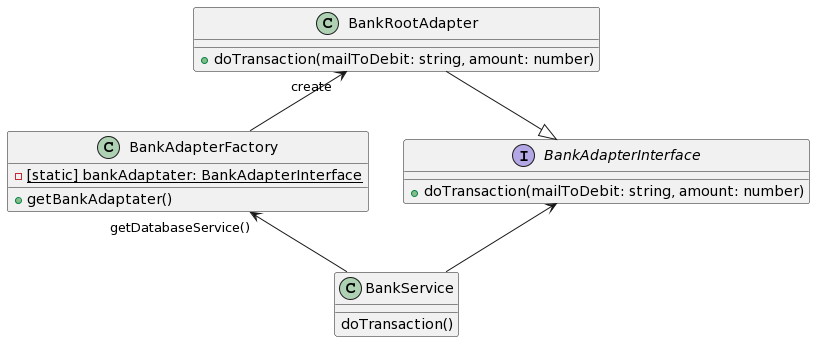

# to do -> un paragraphe sur l'utilisation du pattern adapter et de la factory pour une souplesse max sur la connexion à la banque. Mettre des liens vers refactoring guru pour les patterns !

# Architecture

## Sommaire
<!-- TOC -->
* [to do -> un paragraphe sur l'utilisation du pattern adapter et de la factory pour une souplesse max sur la connexion à la banque. Mettre des liens vers refactoring guru pour les patterns !](#to-do---un-paragraphe-sur-lutilisation-du-pattern-adapter-et-de-la-factory-pour-une-souplesse-max-sur-la-connexion-à-la-banque-mettre-des-liens-vers-refactoring-guru-pour-les-patterns-)
* [Architecture](#architecture)
  * [Sommaire](#sommaire)
  * [TypeScript](#typescript)
  * [Architecture en couche](#architecture-en-couche)
  * [Un adaptateur pour la banque](#un-adaptateur-pour-la-banque)
  * [DAO Pattern](#dao-pattern)
    * [Les deux versions du DAO pattern appliqué au projet cash manager](#les-deux-versions-du-dao-pattern-appliqué-au-projet-cash-manager)
  * [databaseService](#databaseservice)
<!-- TOC -->

## TypeScript

Le projet est codé en TypeScript et paramétré avec un Linter pour garder un code à la fois lisible, maintenable et utilisable avec des features comme la complétion automatique des IDE.

Pour aller plus loin sur l'aspect maintenabilité, le typeScripte permet de garder la simplicité et l'universalité du JS mais sansles risques liés à son typage dynamique.
De cette manière si quelqu'un rejoins l'équipe il lui sera plus simple de participer au code puisque l'IDE l'informera d'erreur de type.

La principal avancé est le fait de pouvoir définir nos propre type. Cela permet de formaliser des structures d'objets, afin de s'assurer que tout le monde utilise les même normes. Cela évité les erreurs aux runtime et facilite la vie des développeurs.
Pour exemple, le type product nous permet de nous assurer de toujours bien correspondre à la table SQL en base de données :

## Architecture en couche

Comme le montre le diagramme de classe suivant, nous avons choisi une architecture en couche.
Cette architecture est un standard de la programmation, ce qui permet d'être facilement compréhensible par les devs.
De plus le principe de la programmation en couche est de minimiser les dépendances entre chaque partie, ici par exemple on peut aisément changer de base de donnée en changeant seulement l'implémentation de `databaseServiceInterface`.

Notre architecture en couche est personnalisée.
Nous n'avons pas voulu suivre le modèle MVC, peu adapté à node JS et à la construction d'une API.
Nous nous rapprochons plus de l'architecture du framework Java Spring, en particulier avec l'intégration des DAO (data access object).
Nous n'avons pas besoins de DTO (data transfert object) puisque les objets JS sont déjà dans le format de données majoritairement utilisé dans le web (Json).

Voilà un diagramme de classe (très simplifié) permettant de comprendre l'architecture que nous avons adopté : 

## Un adaptateur pour la banque

La connexion à la banque est une fonctionnalité importante, avec un fort risque de modification à l'avenir.
Il est donc important de s'assurer que cete fonctionnalité ait un coup de modification le moins élevé possible.

Pour cela nous avons décider d'utiliser le pattern Adapter [(voir Refachttps://refactoring.guru/fr/design-patterns/adaptertoring Guru)](https://refactoring.guru/fr/design-patterns/adapter)
afin de centraliser toute la logique de connexion en une seule classe, interfacé au préalable, qu'il sera ainsi facile de remplacer par une autre instance si besoins.
Créer ainsi un adaptateur encapsulé par une interface permet de faire ce que [les principes GRASP](https://fr.wikipedia.org/wiki/GRASP_(programmation)#Indirection) appellent une indirection, très utile à la maintenabilité du code.

Nous avons couplé le pattern adaptateur à une factory.
Le but est de pouvoir modifier l'instance de `BankAdapterInterface` crée, et donc la logique de connexion à la banque, en une seule ligne pour tout le programme.

La factory permet également d'assurer qu'une seule instance de `BankAdapterInterface` existe en même temps, afin d'optimiser notre API et pour prévenir d'éventuels problème d'accès concurrents.

Voilà un zoom plus détaillé sur notre architecture pour illustrer notre mannière de gérer la connexion à une banque externe :

## DAO Pattern

Le DAO (dont nous avons déjà parlé plus haut) est un design pattern permettant d'isoler la couche base de données du reste de l'application.

Deux versions de ce design pattern existes, une appelée data-mapper et une appelée data-gateway.
Nous avons choisi la version data-gateway, qui permet une meileurs séparation des couches.
Pour illustrer la différence voilà un exemple des deux architectures appliqué à notre projet.

### Les deux versions du DAO pattern appliqué au projet cash manager

Comme on le voit le data-mapper préserve moins bien l'indépendance de la couche base de donnée.

## databaseService

Toujours dans l'optique de découpler un maixmum les dépendance à mysql, nous avons mis en place une couche d'abstraction de haut niveau sur le service d'accès à la base de donnée.

Bien qu'assez simple, le système est très efficace puisque dès lors, tout les DAO dépendent d'une interface.
En cas de changement de base de donnée, il suffit de créer une nouvelle implémentation de cette interface permettant de d'éxecuter une requête.
En changeant simplement la manière dont notre factory instancie l'implémentation de l'interface `databaseServiceInterface`.

Pour mieux comprendre, voici un diagrame de classe simplifié qui se concentre sur l'implémentation du databaseService :

